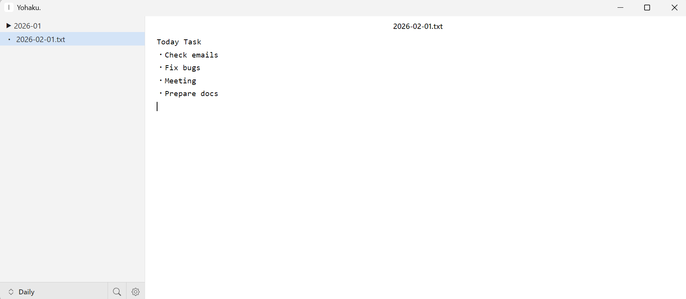

# Yohaku.

ミニマルなテキストエディタ。

[English](./README.md)




## 特徴

- 2カラムレイアウト（ファイルエクスプローラー + テキストエディタ）
- 自動保存（1秒デバウンス）
- テキスト検索と置換（Ctrl+F）
- ディレクトリ内キーワード検索
- ディレクトリのワークスペース設定
- グローバルホットキー対応（設定可能）

## ダウンロード

[Releases](https://github.com/umeneru/yohaku/releases) から Windows (.exe) / Linux (.AppImage) をダウンロードできます。

## 開発

### 必要な環境

- Node.js 22+
- npm

### セットアップ

```bash
git clone https://github.com/umeneru/yohaku.git
cd yohaku
npm install
```

### 開発サーバー起動

```bash
npm run dev
```

### ビルド

```bash
npm run build          # プロダクションビルド
npm run dist           # 配布用パッケージ作成（全プラットフォーム）
npm run dist:win       # Windows用配布パッケージ作成
```

## 技術スタック

- **Electron** - デスクトップアプリケーションフレームワーク
- **React 19** - UIライブラリ
- **electron-vite** - ホットリロード対応ビルドツール
- **CSS Modules** - スコープ付きスタイリング

## プロジェクト構成

```
src/
├── main/            # メインプロセス（ファイル操作、IPC、ウィンドウ管理）
├── preload/         # プリロードスクリプト（contextBridge API）
└── renderer/        # レンダラープロセス（React UI）
    └── src/
        ├── components/
        │   ├── FileExplorer/   # ファイルツリー、検索、コンテキストメニュー
        │   ├── TextEditor/     # エディタ、検索バー
        │   └── Resizer/        # カラムリサイズ
        ├── context/            # AppContext（useReducer + Context API）
        └── App.jsx
```

## ライセンス

[MIT](LICENSE)
